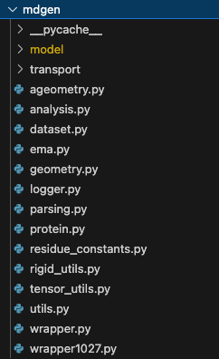
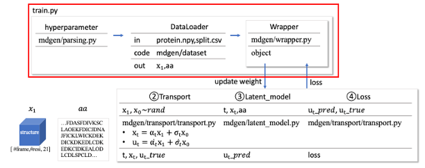
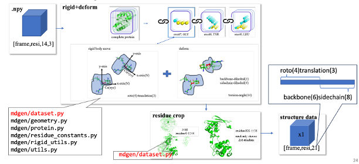
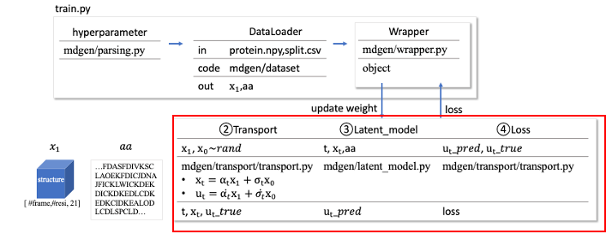
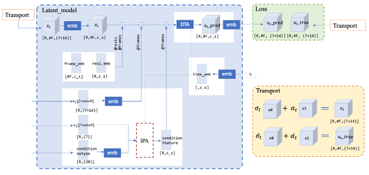
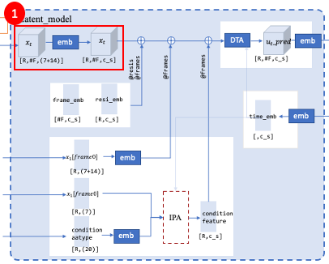
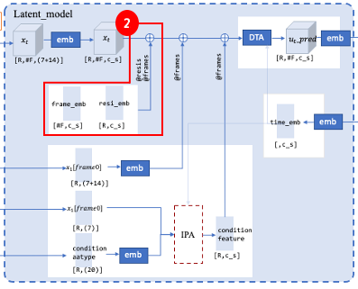
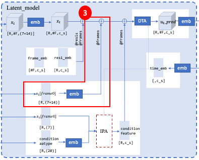
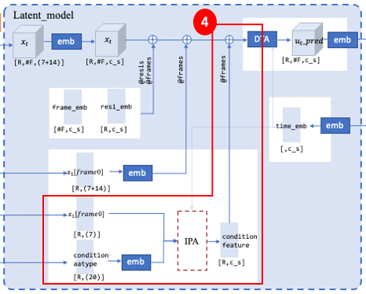
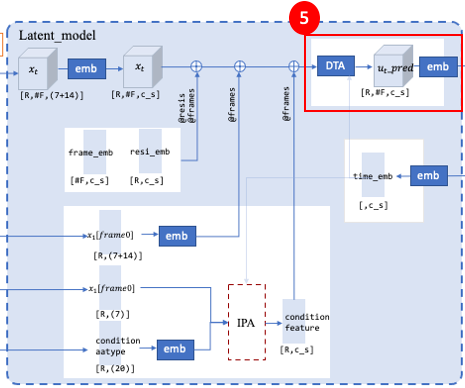

# overview
>
- 我們分成4個part 
    - train 說明的是 hyperparameter -> dataloader -> wrapper
    - wrapper 說明的是 train -> wrapper -> transport 
    - transport 說明的是 transport -> latent_model / loss / update
    - latent_model 說明的是如何使用xt,aa計算出ut_pred
- mdgen_folder
>
# § 1.train
[train.py](../train.py)
>
- hyperparameter
- dataloader
- wrapper
- train

## 1.1hyperparameter
1. 要在terminal下指令 開始訓練 
    >```
    >python train.py \
    >--sim_condition \
    >--train_split splits/atlas_train.csv \
    >--val_split \
    >splits/atlas_val.csv \
    >--data_dir share/data_atlas/ \
    >--num_frames 250 \
    >--batch_size 1 \
    >--prepend_ipa \
    >--crop 256 \
    >--val_repeat 25 \
    >--epochs 10000 \
    >--atlas \
    >--ckpt_freq 1 \
    >--wandb \
    >--run_name mdgen_train
    >```
    - 每一個--都代表參數的輸入 比如說--crop 256就是在protein residue length隨機抽取連續的256個residues當作訓練data
    - 會用 \換行, \的後面不能有空格

1. 有哪些parameter可以輸入呢？ [train.py](../train.py)
    >```
    >from mdgen.parsing import parse_train_args
    >args = parse_train_args()
    >```
    - 會從mdgen/parsing.py裡面去抓參數 具體有哪些參數？
    - [mdgen/parsing](../mdgen/parsing.py), parse_train_args
        >```
        >def parse_train_args():
        >    parser = ArgumentParser()
        >    ...
        >    group = parser.add_argument_group("Transport arguments")
        >    group.add_argument("--path-type", type=str, default="GVP", choices=["Linear", "GVP", "VP"])
        >```
    - 這邊我抓了--path-type作為例子, interpolation要選擇linear/GVP/VP 要在呼叫train.py的時候增加
        >```
        >--path-type Linear \
        >```

    - 就會變成，這樣就代表我們訓練的時候interpolation是用Linear模式
        >```
        >python train.py \
        >--sim_condition \
        >--train_split splits/atlas_train.csv \
        >--val_split \
        >splits/atlas_val.csv \
        >--data_dir share/data_atlas/ \
        >--num_frames 250 \
        >--batch_size 1 \
        >--prepend_ipa \
        >--crop 256 \
        >--val_repeat 25 \
        >--epochs 10000 \
        >--atlas \
        >--path-type Linear \
        >--ckpt_freq 1 \
        >--wandb \
        >--run_name mdgen_train
        >```


## 1.2DataLoader
建立train_loader / val_loader 物件
1. 建立trainset / valset 物件[train.py](../train.py)
    >```
    >from mdgen.dataset import MDGenDataset
    >...
    >trainset = MDGenDataset(args, split=args.train_split)
    >...
    >valset = MDGenDataset(args, split=args.val_split, repeat=args.val_repeat)
    >```
    - MDGenDataset來自[mdgen/dataset.py](../mdgen/dataset.py)
        >```
        >class MDGenDataset(torch.utils.data.Dataset):
        >def __init__(self, args, split, repeat=1):
        >    super().__init__()
        >    self.df = pd.read_csv(split, index_col='name')
        >    self.args = args
        >    self.repeat = repeat
        >```
    - MDGenDataset詳細在做什麼？就是把npy的atom14 xyz轉成data representation的部分
        >
1. 建立train_loader / val_loader 物件 [train.py](../train.py)
    >```
    >train_loader = torch.utils.data.DataLoader(
    >    trainset,
    >    batch_size=args.batch_size,
    >    num_workers=args.num_workers,
    >    shuffle=True,
    >)
    >
    >val_loader = torch.utils.data.DataLoader(
    >    valset,
    >    batch_size=args.batch_size,
    >    num_workers=args.num_workers,
    >)
    >```


## 1.3Wrapper 
建立model物件
1. [train.py](../train.py) 創立model物件
    >```
    >model = NewMDGenWrapper(args)
    >```
    1. [wrapper](../mdgen/wrapper.py)
        >```
        >class NewMDGenWrapper(Wrapper):
        >    def __init__(self, args):
        >        super().__init__(args)
        >...
        >
        >        if not hasattr(args, 'ema'):
        >            args.ema = False
        >        if args.ema:
        >            self.ema = ExponentialMovingAverage(
        >                model=self.model, decay=args.ema_decay
        >            )
        >            self.cached_weights = None
        >```
## 1.4train
1. [train.py](../train.py) 創立trainer物件
    >```
    >trainer = pl.Trainer(
    >    accelerator="gpu" if torch.cuda.is_available() else 'auto',
    >    max_epochs=args.epochs,
    >    limit_train_batches=args.train_batches or 1.0,
    >    limit_val_batches=0.0 if args.no_validate else (args.val_batches or 1.0),
    >    num_sanity_val_steps=0,
    >    precision=args.precision,
    >    enable_progress_bar=not args.wandb or os.getlogin() == 'hstark',
    >    gradient_clip_val=args.grad_clip,
    >    default_root_dir=os.environ["MODEL_DIR"], 
    >    callbacks=[
    >        ModelCheckpoint(
    >            dirpath=os.environ["MODEL_DIR"], 
    >            save_top_k=-1,
    >            every_n_epochs=args.ckpt_freq,
    >        ),
    >        ModelSummary(max_depth=2),
    >    ],
    >    accumulate_grad_batches=args.accumulate_grad,
    >    val_check_interval=args.val_freq,
    >    check_val_every_n_epoch=args.val_epoch_freq,
    >    logger=False
    >)
    >```
1. 開始訓練，把train_loader物件 / val_loader物件 丟到model物件裡去預測velocity然後算誤差 然後更新weight 這樣重複做epoch次[train.py](../train.py)
    >```
    >if args.validate:
    >    trainer.validate(model, val_loader, ckpt_path=args.ckpt)
    >else:
    >    trainer.fit(model, train_loader, val_loader, ckpt_path=args.ckpt)
    >```

# § 2.wrapper
[wrapper.py](../mdgen/wrapper.py)
>
1. 建立transport物件
    >```
    >self.transport = create_transport(
    >    args,
    >    args.path_type,
    >    args.prediction,
    >    None,  # args.loss_weight,
    >)
    >```
1. 建立latent_model物件(model weight e.g. w1 w2...)
    >```
    >self.model = LatentMDGenModel(args, latent_dim)
    >```
1. 建立prep物件(data)
    >```
    >prep = self.prep_batch(batch)
    >```
1.  把latent_model物件 / prep物件 放進去transport物件去generative velocity並計算loss
    >```
    >out_dict = self.transport.training_losses(
    >    model=self.model,
    >    x1=prep['latents'],
    >    aatype1=batch['seqres'] if self.args.design else None,
    >    mask=prep['loss_mask'],
    >    model_kwargs=prep['model_kwargs']
    >)
    >```
1. 建立update物件
    >```
    >def training_step(self, batch, batch_idx):
    >    if self.args.ema:
    >        if (self.ema.device != self.device):
    >            self.ema.to(self.device)
    >    return self.general_step(batch, stage='train')
    >```

    >```
    >def configure_optimizers(self):
    >    cls = torch.optim.AdamW if self.args.adamW else torch.optim.Adam
    >    optimizer = cls(
    >        filter(lambda p: p.requires_grad, self.model.parameters()), lr=self.args.lr,
    >    )
    >    return optimizer
    >```
# § 3.transport
[transport.py](../mdgen/transport/transport.py)
>
1. t, xt, ut_true生成
    >```
    >def training_losses(
    >        self,
    >        model,
    >        x1,           # target tokens
    >        aatype1=None, # target aatype
    >        mask=None,
    >        model_kwargs=None
    >    ):
    >...
    >    t, x0, x1 = self.sample(x1)
    >    t, xt, ut = self.path_sampler.plan(t, x0, x1)
    >```
    - 這邊ut就是ut_true
1. ut_pred 生成
    >```
    >model_output = model(xt, t, **model_kwargs)
    >```
    - 這邊的model就是前面latent_model這個物件, model_output就是ut_pred
1. loss（ut_true,ut_pred) and update
    >```
    >if self.model_type == ModelType.VELOCITY:
    >terms['loss'] = mean_flat(((model_output - ut) ** 2), mask)
    >```
    - 這個地方有呼叫到前面update物件 所以也順便把模型參數給更新了

# § 4.latent_model


- [latent_model](../mdgen/model/latent_model.py)
- 這個地方我們會分成五個part說明
    1. xt_embedding
    1. transformer_embedding
    1. rigid_embedding
    1. ipa_embedding
    1. transformer_block
## 4.1xt_embedding
- 
    >```
    >x = self.latent_to_emb(x)
    >```

## 4.2transformer_embedding
- 
    >```
    >if self.args.abs_pos_emb:
    >    x = x + self.pos_embed
    >
    >if self.args.abs_time_emb:
    >    x = x + self.time_embed[:, :, None]
    >```
## 4.3frame0_embedding
- 
    >```
    >if x_cond is not None:
    >    x = x + self.cond_to_emb(x_cond) + self.mask_to_emb(x_cond_mask)  # token has cond g, tau
    >```
## 4.4ipa_embedding
- 
    >```
    >if self.args.prepend_ipa:  # IPA doesn't need checkpointing
    >    uuu = self.run_ipa(t[:, 0], mask[:, 0], start_frames, end_frames, aatype, x_d=x_d)
    >    
    >    # ##### mdgen-teaching #####
    >    if self.args.teaching_ipa:
    >        np.save(f"{self.args.teaching_ipa}/{mdgen_teaching_t}.npy", uuu.detach().cpu().numpy())
    >    # ##### mdgen-teaching #####
    >
    >    x = x + uuu[:, None]
    >```
## 4.5transformer_block
- 

    >```
    >for layer_idx, layer in enumerate(self.layers):
    >    x = grad_checkpoint(layer, (x, t, mask, start_frames), self.args.grad_checkpointing)
    >    # print(x.shape) # torch.Size([1, 250, 70, 384])
    >...
    >...
    >if not (self.args.dynamic_mpnn or self.args.mpnn):
    >    latent = self.emb_to_latent(x, t)
    >```

    >```
    >self.layers = nn.ModuleList(
    >    [
    >        LatentMDGenLayer(
    >            embed_dim=args.embed_dim,
    >            ffn_embed_dim=4 * args.embed_dim,
    >            mha_heads=args.mha_heads,
    >            dropout=args.dropout,
    >            hyena=args.hyena,
    >            num_frames=args.num_frames,
    >            use_rotary_embeddings=not args.no_rope,
    >            use_time_attention=True,
    >            ipa_args=ipa_args if args.interleave_ipa else None,
    >        )
    >        for _ in range(args.num_layers)
    >    ]
    >)
    >```

    >```
    >class LatentMDGenLayer(nn.Module):
    >    """Transformer layer block."""
    >
    >    def __init__(self, embed_dim, ffn_embed_dim, mha_heads, dropout=0.0, num_frames=50, hyena=False,
    >                 use_rotary_embeddings=False, use_time_attention=True, ipa_args=None):
    >        super().__init__()
    >        self.embed_dim = embed_dim
    >        self.num_frames = num_frames
    >        self.hyena = hyena
    >        self.ffn_embed_dim = ffn_embed_dim
    >        self.mha_heads = mha_heads
    >        self.inf = 1e5
    >        self.use_time_attention = use_time_attention
    >        self.use_rotary_embeddings = use_rotary_embeddings
    >        self._init_submodules(add_bias_kv=True, dropout=dropout, ipa_args=ipa_args)
    >```
